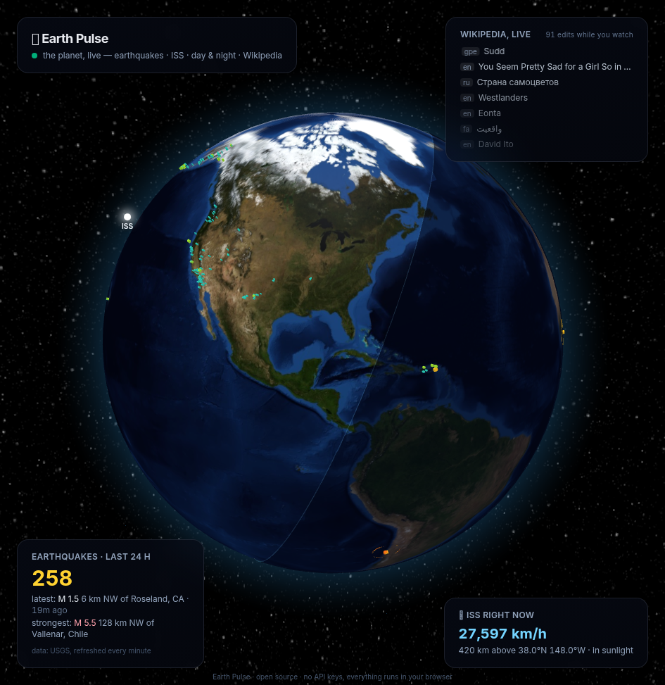

# 🌍 Earth Pulse

**The planet, live.** A real-time 3D globe showing what Earth is doing *right now*:



- 🌋 **Earthquakes** — every quake from the last 24 hours (USGS feed, refreshed every
  minute); points sized and colored by magnitude, M 4+ quakes ripple
- 🛰 **The ISS** — live position, speed and altitude, updated every 5 seconds
- 🌗 **Day & night** — the terminator computed from real solar mechanics, drifting as
  you watch
- 📝 **Wikipedia, live** — a ticker of human edits happening across all Wikipedias,
  streamed over SSE, with a counter of edits seen during your visit

**No backend. No API keys. No tracking.** Everything runs in your browser against
public data feeds (USGS, Where The ISS At, Wikimedia EventStreams). Deployable as a
static site anywhere.

## Run it

```bash
npm install
npm run dev        # http://localhost:5173
npm test           # 13 tests — feed parsing, solar math, ticker logic
npm run lint && npm run build
```

## How the terminator works

`src/lib/sun.ts` computes the subsolar point (NOAA-style approximation: solar
declination + equation of time, good to a fraction of a degree) and builds the night
hemisphere as a GeoJSON polygon — a 90° spherical cap around the antisolar point.
Tests pin it against the 2026 solstice and equinox.

## Stack

React 19 + TypeScript + Vite 7 + Tailwind v4 + [globe.gl](https://github.com/vasturiano/globe.gl)
(three.js). Globe textures are bundled locally (NASA Blue Marble via three-globe).

All data-layer logic lives in pure, tested functions under `src/lib/` — the React
layer only wires feeds to the globe.

---

*Czech: Živá Země — zemětřesení, ISS, den a noc a editace Wikipedie na 3D glóbu
v reálném čase. Bez backendu, bez klíčů, bez sledování.*
