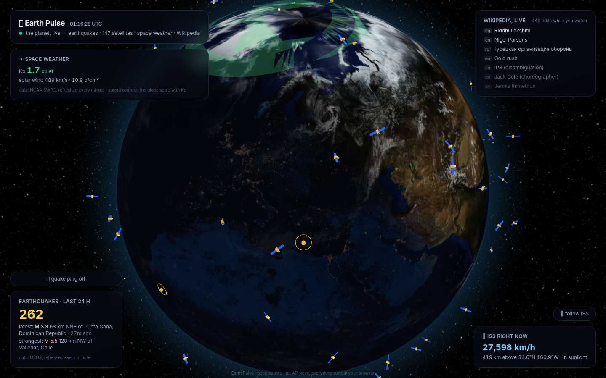
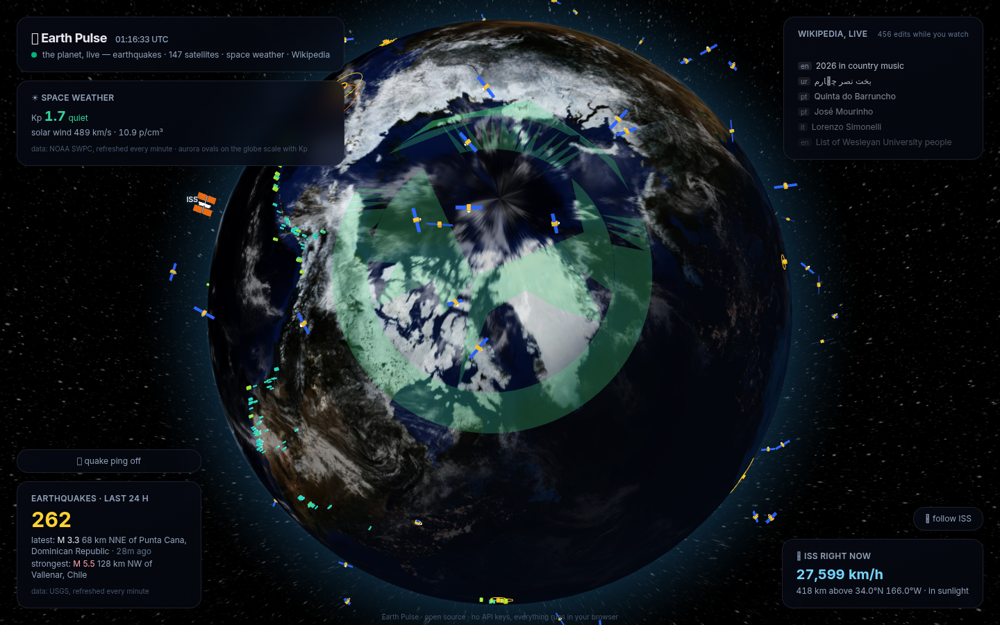
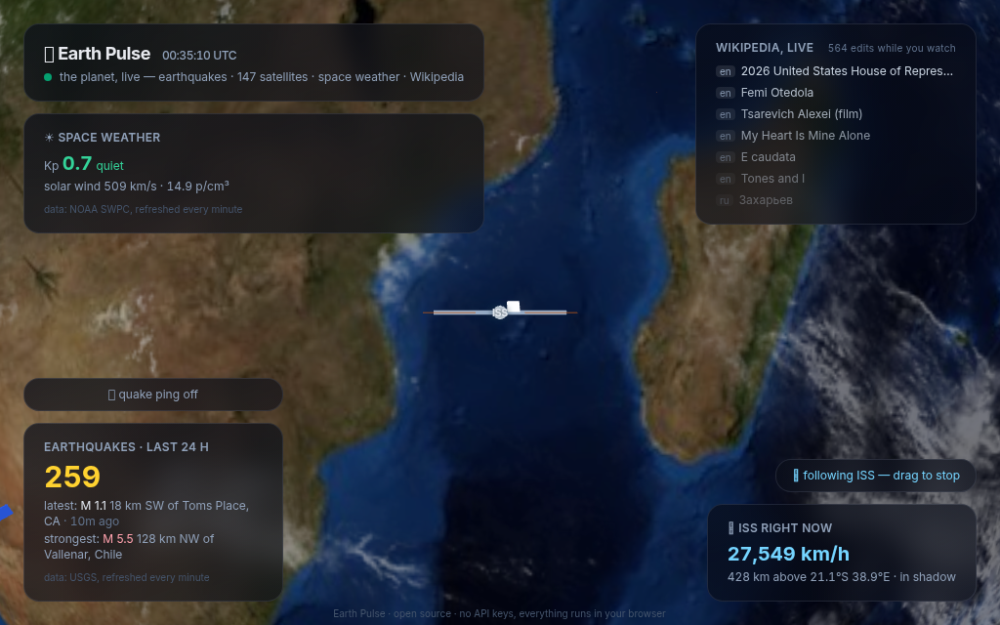

# 🌍 Earth Pulse

**The planet, live.** A real-time 3D globe showing what Earth is doing *right now*:



- 🌃 **Real day & night** — a custom globe shader blends NASA's Blue Marble into
  the night-lights map along the *actual* terminator: city lights switch on exactly
  where the Sun has just set, and the cloud layer fades out with them
- 🌌 **Live aurora** — ovals around the geomagnetic poles that grow and brighten
  with the real-time Kp index; during a geomagnetic storm they visibly push toward
  the mid-latitudes



- 🌋 **Earthquakes** — every quake from the last 24 hours (USGS feed, refreshed every
  minute); points sized and colored by magnitude, M 4+ quakes ripple. A quake that
  happens **while you watch** gets a bright flash ring, a NEW badge, and an optional
  audio ping (🔔 toggle, pitched by magnitude — bigger quake, deeper bell)
- 🛰 **~150 live satellites** — the brightest objects in orbit, propagated locally
  from real Celestrak TLEs with SGP4 ([satellite.js](https://github.com/shashwatak/satellite-js))
  every second. Hover for name and altitude, **click any satellite to draw its
  orbit** (one full revolution, animated). Zero runtime API calls
- 🛰 **The ISS** — live position, speed and altitude every 3 seconds; click the
  station or hit **follow ISS** for a chase camera (drag the globe to break away)
- ☀️ **Space weather** — planetary Kp index (green calm → red geomagnetic storm) and
  solar wind speed, straight from NOAA SWPC
- 🌗 **The terminator drifts as you watch** — computed from real solar mechanics
  (subsolar point: solar declination + equation of time), refreshed every minute
- 📝 **Wikipedia, live** — a ticker of human edits happening across all Wikipedias,
  streamed over SSE, with a counter of edits seen during your visit

Satellites and the ISS are miniature 3D models (body + solar wings; the ISS gets its
truss, module stack and amber arrays) — zoom in or hit **follow ISS**:



**No backend. No API keys. No tracking.** Everything runs in your browser against
public data feeds (USGS, Where The ISS At, NOAA SWPC, Wikimedia EventStreams) plus a
bundled TLE snapshot. Deployable as a static site anywhere.

## Run it

```bash
npm install
npm run dev        # http://localhost:5173
npm test           # 27 tests — feed parsing, solar math, SGP4 sanity, aurora, ping scales
npm run lint && npm run build
npm run fetch-tle  # refresh the bundled Celestrak TLE snapshot (do this every few days)
```

## How the live layers work

- `src/lib/sun.ts` computes the subsolar point (NOAA-style approximation, good to a
  fraction of a degree); a custom `ShaderMaterial` blends the day and night textures
  along that direction, and the cloud layer shares the same Sun uniform so clouds
  vanish on the night side. Tests pin the math against the 2026 solstice and equinox.
- `src/lib/aurora.ts` turns the live Kp into annulus polygons around the IGRF
  geomagnetic poles — equatorward reach, width and opacity all scale with Kp.
- Performance: satellite propagation runs in a 1 Hz engine inside the globe
  component, mutating stable objects and bypassing React entirely; heavy HUD panels
  are memoized; the cloud texture ships as a 1.1 MB WebP (was a 5 MB PNG).
- `src/lib/satellites.ts` parses the bundled TLE file and propagates all satellites
  with SGP4 each second — real orbital motion, no server. Celestrak blocks browser
  CORS, so `scripts/fetch-tle.mjs` snapshots the data at build time; TLEs stay
  accurate for days.
- `src/lib/spaceWeather.ts` reads NOAA SWPC's Kp and solar-wind feeds (both send
  `Access-Control-Allow-Origin: *`, so the browser talks to NOAA directly).
- `src/lib/quakes.ts` diffs feed refreshes by quake id — anything unseen since the
  initial load is "new" and triggers the flash ring / NEW badge / ping.

## Stack

React 19 + TypeScript + Vite + Tailwind v4 + [globe.gl](https://github.com/vasturiano/globe.gl)
(three.js) + satellite.js. Globe and cloud textures are bundled locally (NASA Blue
Marble via three-globe).

All data-layer logic lives in pure, tested functions under `src/lib/` — the React
layer only wires feeds to the globe.

---

*Czech: Živá Země — skutečná světla měst podél živého terminátoru, polární záře
podle reálného Kp indexu, ~150 satelitů ze skutečných TLE dat s klikací orbitou,
ISS s follow kamerou, zemětřesení s detekcí nových otřesů a editace Wikipedie na
3D glóbu v reálném čase. Bez backendu, bez klíčů, bez sledování.*
