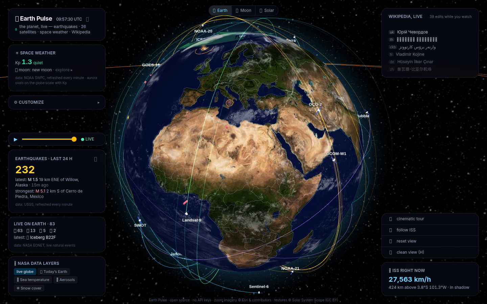
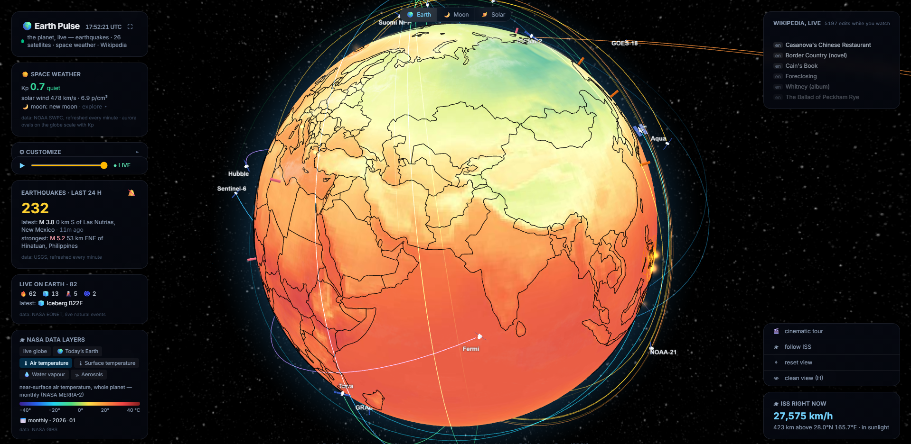
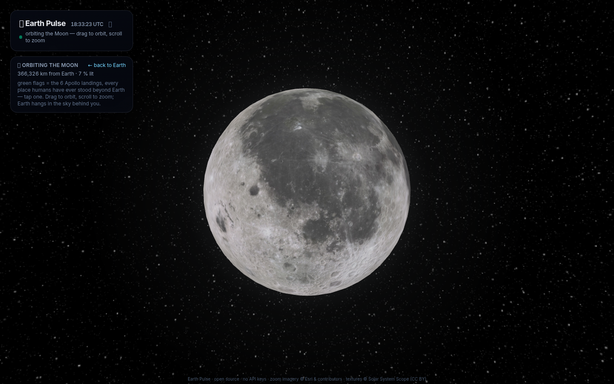
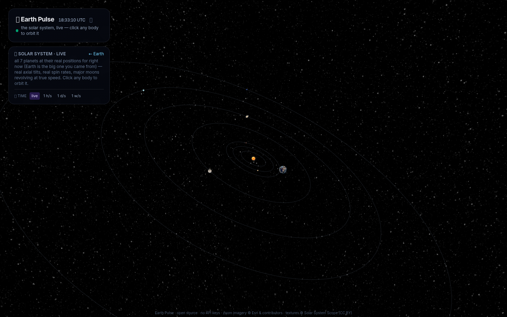
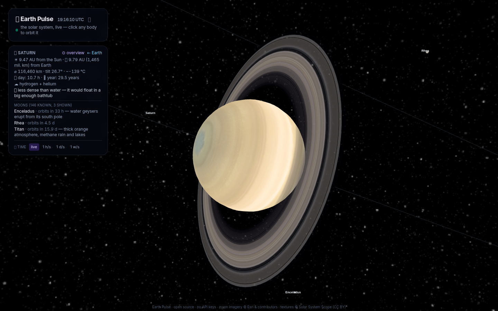

# 🌍 Earth Pulse

**The planet — and its whole neighborhood — live.** A real-time 3D globe with no
backend, no API keys and no tracking: everything runs in your browser against
public data feeds.

**🔗 Live: https://earth-pulse-rosy.vercel.app/** · free & open source (MIT)



## 🌍 Earth, live
- 🌋 **Earthquakes** — USGS 24h catalog (minute refresh) **plus the EMSC
  SeismicPortal WebSocket**: a quake lights up within ~a minute of the actual
  shaking — flash ring, NEW badge, optional sound ping pitched by magnitude.
  Additive glow sprites on a warm ramp, fading with event age; a ⏪ timeline
  replays the last 24 h as a film
- 🛰 **26 famous satellites** (ISS, Hubble, Terra, Sentinels, GOES, Landsat…) —
  Celestrak "active" TLEs propagated with SGP4 **every frame** (truly fluid
  orbital motion, zero runtime API calls). Each has a detailed model, a name
  tag, and a 🛰 **mission card** (agency, launch year, what it measures); click
  one for a **closed neon orbit ring** coloured by mission type, with a
  direction arrow. Search them by name
- 🔥 **Latest natural events** — NASA **EONET** feed: live fires, storms,
  volcanoes and ice as colour-coded pins, with a "Live on Earth" panel counting
  them by category
- 🌍 **Vital-signs data layers** — NASA **GIBS** imagery painted on the globe,
  all whole-planet: today's true-colour Earth, plus **air temperature**,
  **surface temperature**, **water vapour** and **aerosols** (NASA MERRA-2) —
  each with a graduated °C/scale colour-bar legend and the continents outlined
  in black, plus a **date slider** (daily layers replay the last 30 days)
- 🛰 **The ISS** — flies smoothly on its SGP4 track, live API telemetry in the
  HUD, **follow chase-camera**, and after you share your location: **"the ISS
  is over you in 2 h 14 min"** (real pass prediction) + a live **"above you
  now"** list of satellites over your horizon
- 🌃 **Real day & night** — a custom shader blends the day texture into city
  lights along the *actual* terminator, with a warm civil-twilight band; clouds
  share the same Sun and fade out at night. **Day & night replay too**: the
  terminator and the Moon follow the ⏪ 24h time slider, not just the quake
  filter. Textures come in three tiers — a **2K / 4K / 8K quality selector**
  (weak GPUs drop to 2K automatically, phones are capped at 4K)
- 🔎 **Map-grade zoom** — Esri World Imagery streams in below ~1500 km (LOD to
  street level, night-side dimmed); zoom out and the live globe returns.
  🗺 Country borders + names, 🌌 aurora ovals scaled by the live Kp index,
  ☀️ space weather (NOAA SWPC), 🌋 1,215 Holocene volcanoes, 📝 live Wikipedia
  edits, 🎬 a cinematic auto-tour, 🔗 **shareable view links** (camera, orbits
  and layers travel in the URL hash)



## 🌙 The Moon — click it
Click the Moon in the sky (it sits at its real position) and the camera flies
over: **you orbit the Moon like Earth**, with Earth hanging in the lunar sky. A
custom shader lights it by the **real Sun direction**, so the lit crescent
matches tonight's actual phase, with a faint earthshine on the dark side. Small
**flags** mark the six Apollo landings — every place humans have ever stood —
tap one for the mission and crew.



## 🪐 The whole solar system
One button and you're above the ecliptic: the Sun and all seven other planets
at their **real positions for right now** (JPL approximate ephemerides), real
axial tilts (Uranus on its side), real spin rates, ring systems, and **major
moons revolving at their true periods** — Io in 1.77 days, Triton backwards,
and Earth's own **tidally-locked Moon** (its near side always faces Earth).
Click any body to orbit it. Then grab the **⏩ time-warp** (up to a
week per second) and watch the system dance — planets slide along their
orbits, moons whirl, and even Earth's terminator and satellites speed up.

The solar view goes deeper than the planets: **11 deep-space probes** —
Voyager 1 & 2, New Horizons, Parker Solar Probe, Solar Orbiter, BepiColombo,
JUICE, Europa Clipper, Psyche, Lucy and Hayabusa2 — fly their **real
trajectories from NASA JPL HORIZONS** (re-baked weekly), each with a 3D model,
a comet trail and a live speed/distance card. Behind them hangs the **real
night sky**: 8,921 naked-eye stars from the HYG catalogue at their true
positions, with constellation lines and names — click a star for its story, a
physically-derived procedural 3D close-up, and (for 13 famous stars) a real
telescope photo.




## And more modes
- 🛰 **Starlink swarm (opt-in)** — the real **~10,700-satellite** constellation
  as a single GPU-instanced mesh, SGP4-propagated in a web worker, with the
  nearest few hundred swapping in a real 3D model as you dive in
- 🗺 **Continental Drift** — scrub the globe through **340 million years**,
  from Pangaea to today (Scotese/PALEOMAP frames every 5 Myr) and onward to a
  projected **Pangaea Proxima** (+250 Myr)
- 📡 **Sky AR** (phones) — point your camera at the sky and the overlay names
  the satellites passing overhead, with distance, plus the Moon and planets
- 📲 **Installable PWA** with an offline service worker

## Run it

```bash
npm install
npm run dev             # http://localhost:5173
npm test                # 108 unit tests (vitest) — ephemerides, SGP4, feeds, share links
npm run e2e             # 5 Playwright e2e tests against the real WebGL globe
npm run lint && npm run build

# refresh the bundled data snapshots (a weekly GitHub Action does this too):
npm run fetch-famous    # 26 famous-satellite TLEs (Celestrak) → public/tle/famous.txt
npm run fetch-starlink  # ~10.7k Starlink TLEs → public/tle/starlink.txt
npm run fetch-probes    # deep-space probe trajectories (NASA JPL HORIZONS)
npm run fetch-volcanoes # Smithsonian GVP volcano snapshot
```

CI runs lint + build + unit + e2e on every push, and a weekly GitHub Action
re-bakes the TLE and probe-trajectory snapshots so the orbits never go stale.

The HUD is mode-aware (Earth dashboards disappear on the Moon and in the solar
system) and adapts to weak GPUs automatically (⚡ eco mode: 4K textures, 1×
pixel ratio, 30 Hz propagation — with an FPS watchdog).

**Navigation & UX:** a persistent 🌍/🌙/🪐 world switcher (keys `1`/`2`/`3`,
`H` to hide the HUD, `Esc` home), a ⌖ camera reset, and a cinematic kiosk that
auto-tours after a while idle. On desktop the dashboards live in the corners;
on phones & tablets they collapse into two slide-out drawers so the globe stays
clear. Orbits are drawn as comet trails — a fading tail behind each body marks
where it is right now — and a glowing intro animation greets first load.

## How it works

- **All layer logic is pure and tested** under `src/lib/` (solar/lunar/planetary
  ephemerides, SGP4 wrappers, feed parsers, share-URL codec). The React layer
  only wires feeds to the globe; the 3D scene is composed from feature modules
  in `src/components/globe/` (see `docs/adr-001`).
- Satellites propagate per animation frame outside React; the orbit pivot can
  pin to the Moon, the Sun or any planet (globe.gl resets the controls target
  every frame — we get the last word).
- Data: USGS + EMSC (quakes), Celestrak (TLE snapshots — famous + Starlink),
  **NASA JPL HORIZONS** (probe trajectories), HYG (stars), Where The ISS At,
  NOAA SWPC (Kp + solar wind), Wikimedia EventStreams, Natural Earth
  (borders/names), Smithsonian GVP (volcano snapshot), **NASA EONET** (natural
  events) and **NASA GIBS** (data layers) — all free, no keys, CORS-friendly.

## Documentation
Deep docs live in [`docs/`](docs/) (Czech):
- [`FUNKCE.md`](docs/FUNKCE.md) — full feature reference, mode by mode
- [`ARCHITEKTURA.md`](docs/ARCHITEKTURA.md) — code structure, data flow, eco mode, share URLs
- [`DATOVE-ZDROJE.md`](docs/DATOVE-ZDROJE.md) — every live feed, refresh rate, attribution
- [`CHANGELOG.md`](docs/CHANGELOG.md) — the build journey, from v0.1 to today
- [`adr-001-globe-feature-modules.md`](docs/adr-001-globe-feature-modules.md) — why the scene is split into feature modules

## Stack & credits

React 19 + TypeScript + Vite + Tailwind v4 + [globe.gl](https://github.com/vasturiano/globe.gl)
(three.js) + satellite.js + topojson-client. 8K Earth, Moon, planet and
Milky Way textures © [Solar System Scope](https://www.solarsystemscope.com/textures/)
(CC BY 4.0), zoom imagery © Esri & contributors.

---

*Czech: Živá Země — zemětřesení do minuty, skuteční satelité s orbitami, ISS,
polární záře, světla měst podél živého terminátoru, Měsíc s místy přistání
Apolla a celá sluneční soustava s time-warpem. Bez backendu, bez klíčů.*
